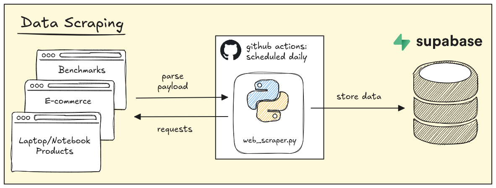
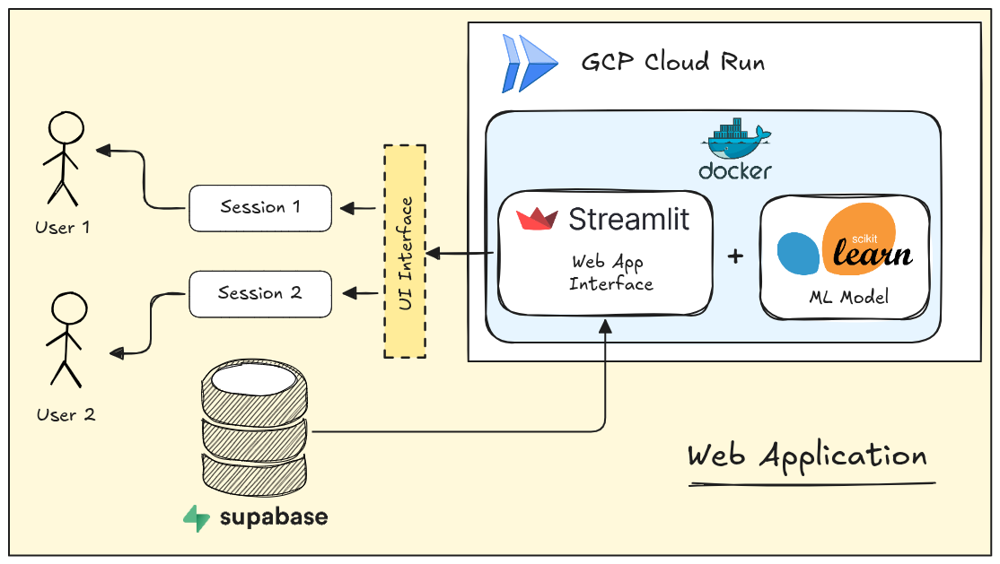
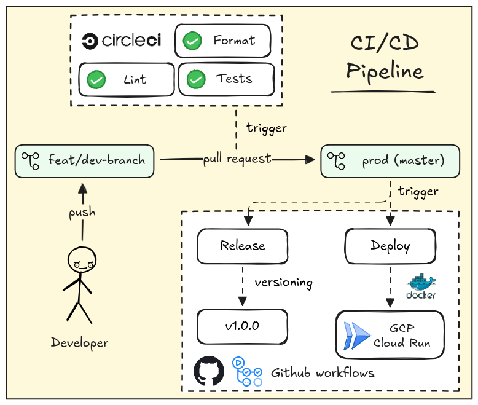
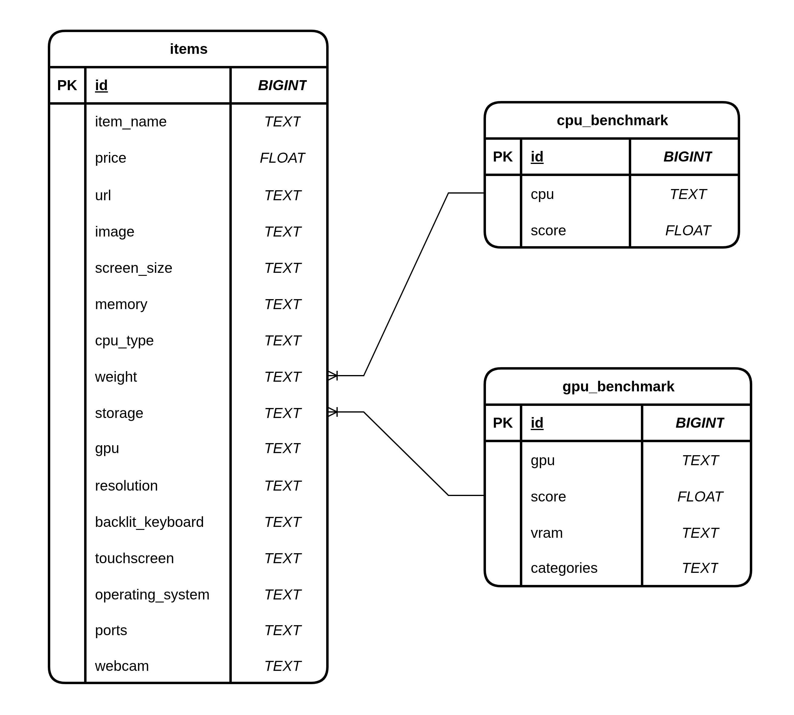

# Project Overview: Findtech

Findtech is friendly and fast ML-based Laptop/Notebook recommender web app for non-technical persons who did not really know about "How to choose device that fit their needs and budget in the current market".

This project represents end-to-end machine learning system design with features:

- Raw data collection from e-commerce web scraping scheduled on daily basis
- ML model to translates non-technical jargon question and answer into recommended product
- Streamlit web app for user interaction and queries
- End-to-end CI and CD pipeline using CircleCI, Docker, and Github workflows

> Note:
> This is my personal project built on curiosity and free-time :)  
> Therefore the whole project may not always be maintained 24/7.

---

# Background

## Problem Definition

Laptop/Notebook buyers with less knowledge about computer specs usually have these common hurdles:

- They don't know what kind of specs they actually need
- Hard to compare different price and specs across brand's catalog
- A lot of options out there and running through 1-by-1 takes a lot of time

## Proposed Solution

Refer to the problem statement above, we can create a **recommendation systems** that genereate list of specific Laptop/Notebook product based on curated features related to the common buyer questions such as:

- Q1: What is the product system or brand? (Acer, ASUS, MacOS, Windows, etc)
- Q2: How much is the product price? ($$ price)
- Q3: Does it be suitable for my main usage? (RAM, CPU, GPU)
- Q4: How portable is the product? (weight, battery size)
- Q5: Do I need to buy complementary items? (ports, camera, etc)
- Q6: Does the product suitable for my activity? (outdoors, indoors, etc)
- Q7: Does the product have upgradable components? (RAM or SSD slot)
- Q8: Does the screen support touch input? (stylus or finger touch)

Here we encode the "technical" hardware and software specs to represents the answers to those questions. Then, train the ML model using that features to output top 5 products including the details based on prediction scores.

---

# System Design

## Architecture Overview

## Data Model

## ML Modeling

---

# Installation

## Prerequisites

- Python >=3.12
- Poetry ==2.2.1
- Docker
- CircleCI
- Supabase

## Configuration

## Install

---

# How to Run?
