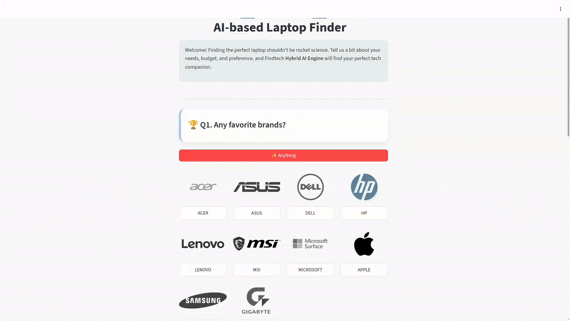

<h1 style="text-align: center;">Findtech</h1>

<div align="center">


[](https://dl.circleci.com/status-badge/redirect/gh/alfialdo/Findtech/tree/master)

</div>

<p align="center">
  
</p>

Findtech is friendly and fast ML-based Laptop/Notebook recommender web app for non-technical persons who did not really know about "How to choose device that fit their needs and budget in the current market".

This project represents end-to-end machine learning system design with features:

- Raw data collection from e-commerce web scraping scheduled on daily basis
- ML model to translates non-technical jargon question and answer into recommended product
- Streamlit web app for user interaction and queries
- End-to-end CI and CD pipeline using CircleCI, Docker, and Github workflows

> Note:
> This is my personal project built on curiosity and free-time :) <br>
> Therefore the whole project may not always be maintained 24/7.

---

# Background

## Problem Definition

Laptop/Notebook buyers with less knowledge about computer specs usually have these common hurdles:

- They don't know what kind of specs they actually need
- Hard to compare different price and specs across brand's catalog
- A lot of options out there and running through 1-by-1 takes a lot of time

## Proposed Solution

Refer to the problem statement above, we can create a **recommendation systems** that genereate list of specific Laptop/Notebook product based on curated features related to the common buyer questions such as:

- Q1: What is the product system or brand? (Acer, ASUS, MSI, Samsung, etc)
- Q2: How much is the product price? ($$ price)
- Q3: Does it be suitable for my main usage? (RAM, CPU, GPU, storage)
- Q4: How portable is the product? (weight, battery size)
- Q5: I need big screen for my activity, can it fit that? (screen size, resolution)
- Q6: Doe I need to buy complementary items? (touchscreen, webcam, card reader, etc)

Here we encode the "technical" hardware and software specs to represents the answers to those questions. Then, train the ML model using that features to output top 5 products including the details based on prediction scores.

---

# System Design

## Architecture Overview

<div align="center">
    
    <br>
    
    <br>
    
</div>

## Data Model

<div align="center">

</div>

## ML Modeling

The core recommendation engine utilizes a **Hybrid Content-Based** approach. This method ranks laptops by calculating the geometric similarity between a user's preferences and the available inventory, while applying a "soft" penalty for items that exceed the user's budget.

### Feature Engineering

The primary goal of this stage is to generate embeddings that serve as a lookup table for the model. To ensure recommendations feel relevant rather than just raw spec-matching, the system first automatically classifies every laptop into a "Persona" (Gaming, Content Design, Business, Academy, or Personal)

Once classified, the Findtech system converts both the User and the Laptop into multi-dimensional vectors to calculate their mathematical compatibility:

- **The Item (Laptop) Vector:** A composite vector that aggregates the Usage Category (One-Hot Encoded), Portability (Inverse Weight), Screen Size, Brand, and specific Extra Features (e.g., Webcam, Thunderbolt).
- **The User (Query) Vector:** Constructed dynamically from user inputs. For example, if a user requests a "Gaming" laptop, the target category is set to `1.0`, the desired portability/size is `0 ~ 1.0`, and the Brand flag is set to `weighted value`.

### Score-based Recommendation

The final ranking score for each laptop is determined by the following formula:

$$
S_L = \underbrace{\cos(\theta)}_{\text{Similarity}} \times \underbrace{e^{-\alpha \times \max(0, P - B)}}_{\text{Price Decay}}
$$

This scoring mechanism consists of two key components:

1. **Cosine Similarity ($\cos \theta$):** This measures the angle between the User's "Ideal Vector" and the Laptop's vector. A score of indicates a perfect feature match.
2. **Price Decay:** Instead of strictly filtering out laptops that are slightly over budget, the system applies a "soft penalty."
   - **Under Budget:** The score remains intact.
   - **Over Budget:** The score decays exponentially.

---

# How to Run?

## Prerequisites

- Python >=3.12
- Poetry ==2.2.1
- Docker
- CircleCI
- Supabase

## Install with Docker

```bash
make docker-build
```

## Run Streamlit App

```bash
make run
```

---

# Development

## Install Dependencies

```bash
# Ensure using python version is 3.12, install:
make install-dev

# or using poetry directly
poetry install

# test web app
make docker-build
make run-dev

```

## Pull-Request Workflow

```bash
# Create unit tests if needed, for local test run:
make check

# Create tag after merge
git tag v1.*.* [commit-hash]
git push origin master --tag

```
